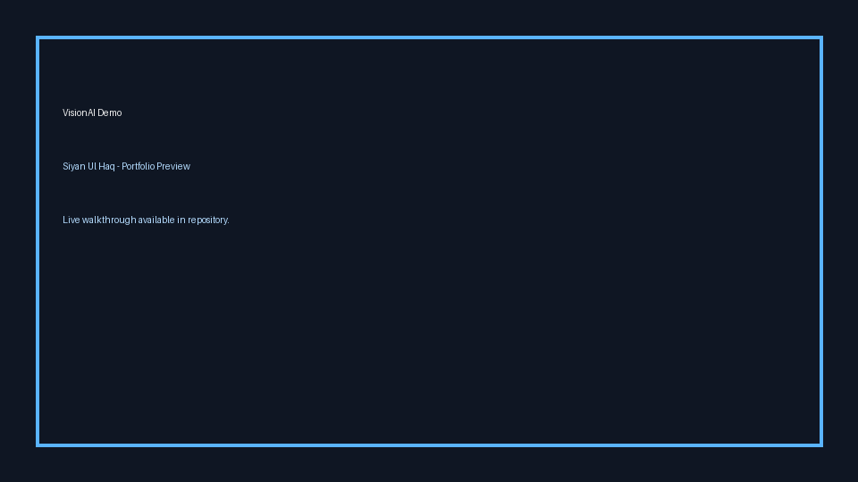

# WorkSense


AI-powered workplace intelligence platform helping employees with contract analysis, review decoding, salary insights, and burnout awareness.

## Demo


> Replace `docs/demo.gif` with your product walkthrough GIF.

## Key Features
- Contract risk analysis with actionable guidance
- Performance review decoding into plain language
- Salary intelligence and negotiation support
- Burnout tracking and early-risk insights

## Quick Start
```bash
# backend
cd backend
uvicorn main:app --reload

# frontend
cd ../frontend
npm install
npm start
```

## Resume Bullets
- Developed an AI-powered employee support platform combining FastAPI, React, and LLM integrations.
- Built multiple practical modules for contract analysis, review decoding, salary benchmarking, and burnout risk tracking.
- Shipped a full-stack architecture with clear user-focused outcomes and scalable product structure.